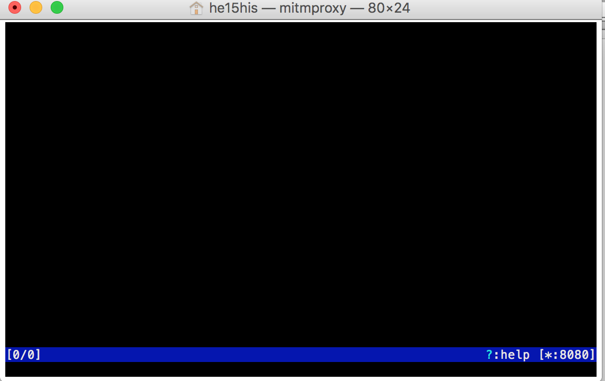
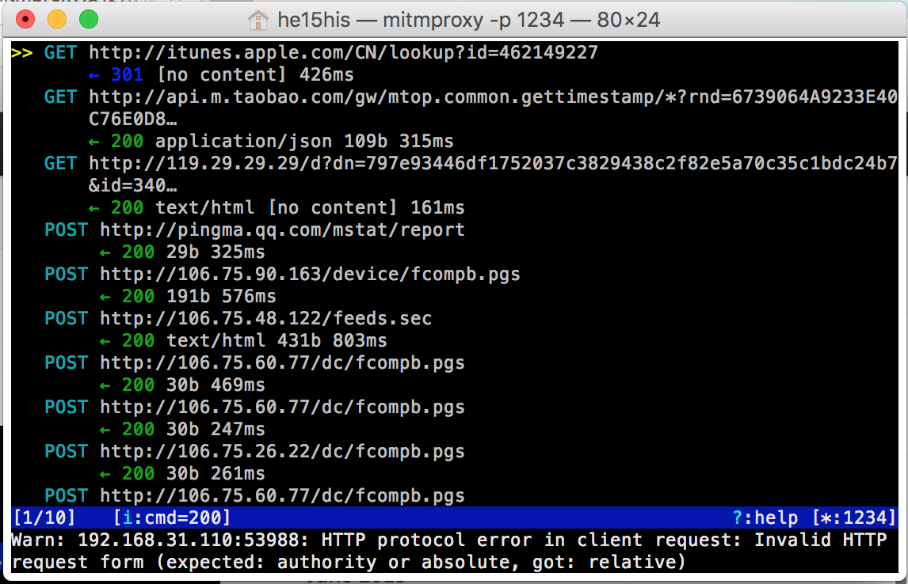
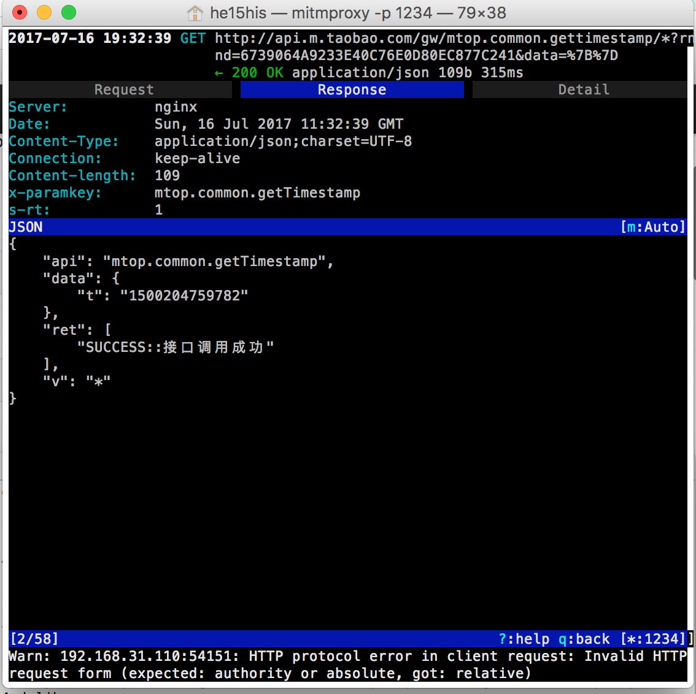
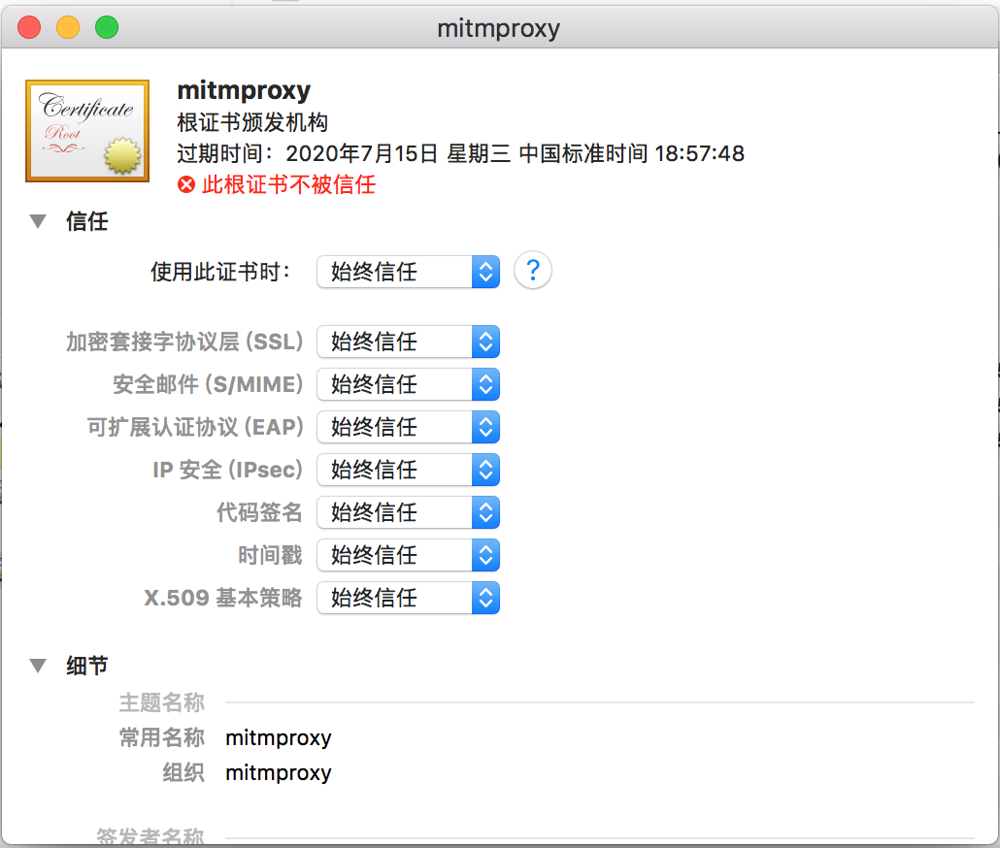
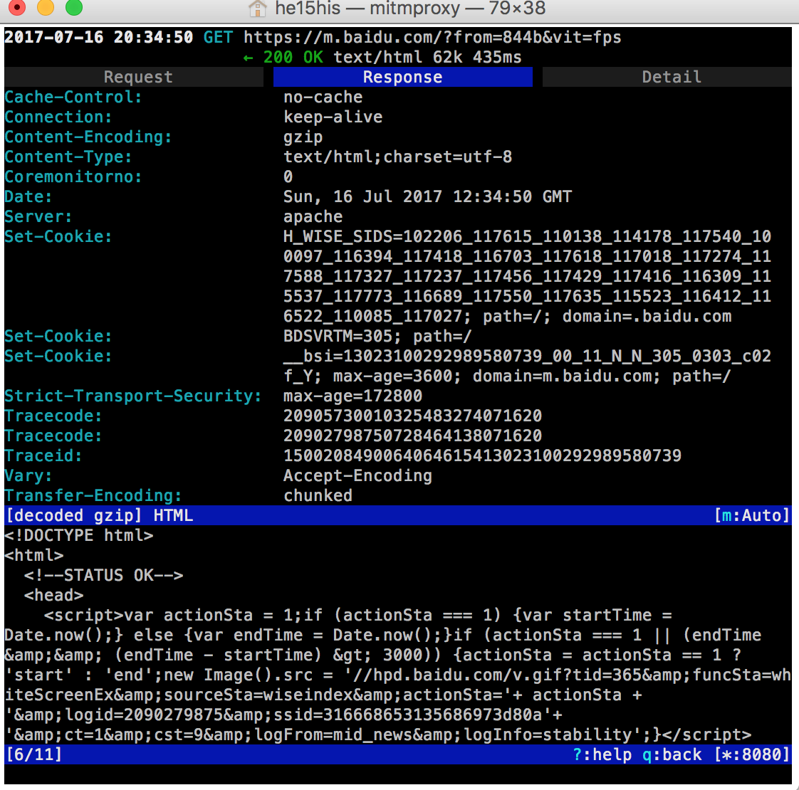
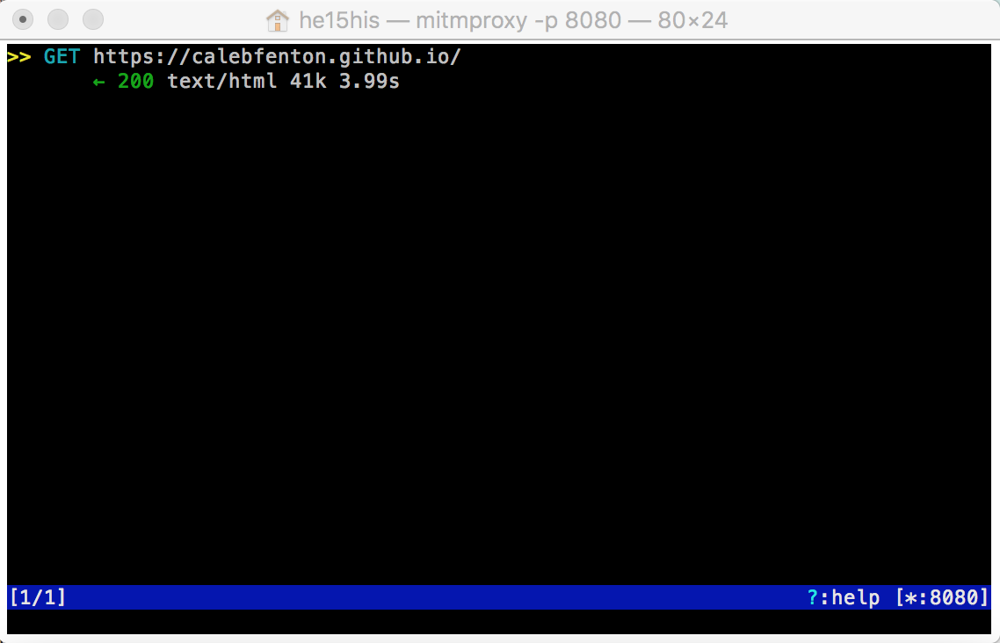

## 监控一个OSX应用的HTTPS流-实例

###准备工作

####1.安装proxychains-ng

```
$ brew install proxychains-ng
```
ok，安装没有什么问题，安装完成后proxychains.conf文件会自动创建在/usr/local/Cellar/proxychains-ng/4.7/etc/proxychains.conf,进入文件查看下面几项配置是否正确

```
strict_chain
quiet_mode
proxy_dns
remote_dns_subnet 224
tcp_read_time_out 15000
tcp_connect_time_out 8000

[ProxyList]
http 127.0.0.1 8080
```
**注意**:最后一行http是小写，自动生成的是HTTP，我开始就是因为这个没有成功


####2.用pip安装mitmproxy
没有安装pip的使用```$ easy_install pip```进行安装，接下来安装mitmproxy

```
\# 因为我知道你可能从来不更新pip，并且这是一个测试，看你是会仔细看还是只是拷贝/复制一切
sudo pip install --upgrade pip
sudo pip install mitmproxy # 这是关键
\#如果用的是python2，用sudo pip install "mitmproxy==0.18.2"，因为新版本只支持python3 (译者注)
```

**提醒**：千万别替换系统的python2.7版本(使用```$ python --version```查看版本)，这会出现一系列链接问题，比如Xcode会打不开，直接安装0.18.2的吧


###实战

####1. mitmproxy小试牛刀
等一切安装完成，终端输入```$ mitmproxy ```直接启动监控，默认端口是8080，也可使用```$ mitmproxy -p 1234```指定端口，启动后如图



接着，把手机与电脑连到同一局域网，把手机代理设置为电脑IP,端口为8080，访问一个页面试试,是不是收发数据都在终端上显示了出来



点进一个请求可以查看详细请求响应内容


详细操作在这里可以找到：<http://mitmproxy.org/doc/mitmproxy.html>


####2.HTTPS监控
上面已经能抓到http的包了，不过并没有看到https的包，接下来带大家抓取https包

启动过mitproxy后它会在~/.mitproxy生成一个根证书


双击mitmproxy-ca-cert.pem安装到本机，此时证书还不被信任，右键点击显示简介，选择始终信任




信任后如下图


我们把手机上也安装上证书，以便于可以抓取手机上的HPPTS请求，
可以使用AirDrop发送接收证书文件到手机，然后信任安装

手机使用Safari访问百度试试，由于我们使用的mitproxy证书，是不被浏览器信任的，需要手动点击弹出的信任按钮，成功抓到https包如图



####3.抓取电脑上的请求
现在你已经有了一个localhost的proxychains配置，证书已装，mitmproxy正在运行，使用mitmproxy和proxychains4抓取电脑的请求试试


```
$ proxychains4 -f proxychains.conf curl https://calebfenton.github.io/

```
直接抓取到了



