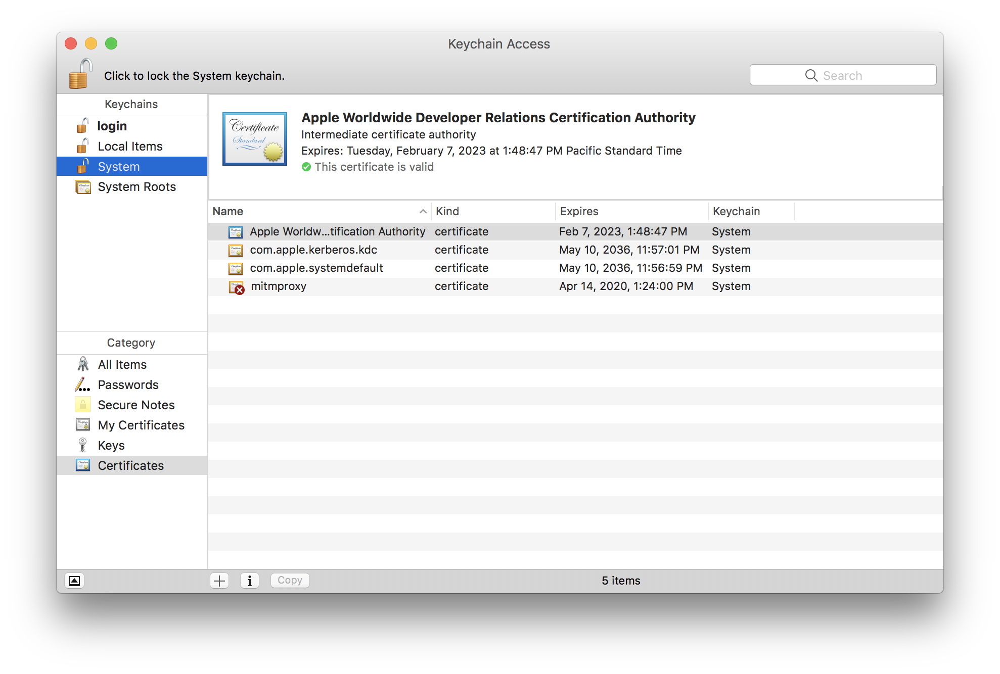
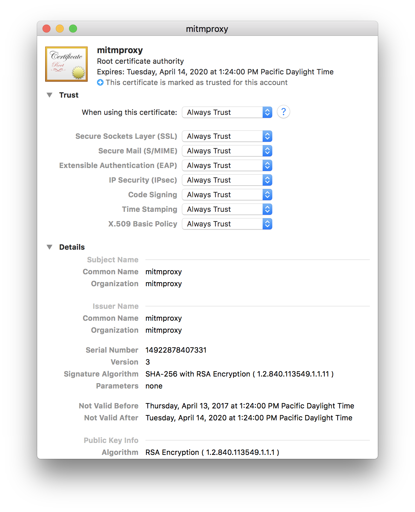
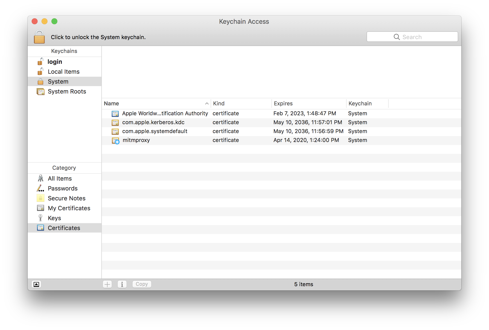

## 监控一个OSX应用的HTTPS流

###### 原文：[Monitoring HTTPS Traffic of a Single App on OSX](https://calebfenton.github.io/2017/05/27/monitoring-https-of-a-single-app-on-osx/)

如果你要逆向网络协议或者做一些网络安全的事，你可能至少需要收集一次网络流来了解网络协议或者查找一些敏感信息。在过去美好的日子里，仅仅用tcpdump就可以看到明文的数据包。现在，每个人都竖起加密的大旗——一群无法应对黑客攻击的人，他们的账号和私有数据被黑客为了几百个狗币（[dogecoin](https://coinmarketcap.com/currencies/dogecoin/)）而卖到[暗网](https://www.4chan.org)上。

今时今日，做任何网络分析绝对需要HTTPS/SSL/TLS拦截的知识并且事实证明现在它是非常重要的。当然，这说的通因为TLS的重点是使你的通信安全。像任何其他少走的路一样，拦截TLS有几条警告。首先，你必须明白中间人攻击（[Man-in-the-MiddleAttack](https://security.stackexchange.com/questions/8145/does-https-prevent-man-in-the-middle-attacks-by-proxy-server)）、证书工作原理、如何安装证书到你系统上、让你的系统和某些应用使用这些证书。最后，你要浏览设置一些代理文档和配置来拦截和显示网络流。

在这篇文章中，我将描述如何监控一个macOS应用的HTTPS网络流以及我遇到的一些令人沮丧的问题的解决方案。

### 概述

拦截网络流的过程如下：

1. 生成一个根证书
2. 安装这个证书
3. 使用[proxychains](https://github.com/rofl0r/proxychains-ng)代理一个应用的网络流
4. 使用[mitmproxy](https://mitmproxy.org/)拦截网络流
5. 因为某些原因它并没起作用而对电脑大喊大叫。

你读了这篇文章就可以跳过第5步了。祝贺！

### 安装工具

用brew安装proxychains, proxychains末尾要加`-ng`：

```shell
	brew install proxychains-ng
```

这有个稍微新点的版本[GitHub](https://github.com/haad/proxychains),但是我并不急于使用它，并且brew formula 明显[不在brew仓库里](https://gist.github.com/allenhuang/3792521#gistcomment-1367295)。你想隐藏什么呢，兄弟？

创建proxychains.conf 并添加下面几行：

```
strict_chain
quiet_mode
proxy_dns
remote_dns_subnet 224
tcp_read_time_out 15000
tcp_connect_time_out 8000

[ProxyList]
http 127.0.0.1 8080
```

最重要的一行是`http 127.0.0.1 8080`,使proxychains把应用的所有网络流重定向到127.0.0.1的8080端口，这个端口是mitmporxy在使用。

下一步，用pip安装mitmproxy:
```
# 因为我知道你可能从来不更新pip，并且这是一个测试，看你是会仔细看还是只是拷贝/复制一切
sudo pip install --upgrade pip
sudo pip install mitmproxy # 这是关键
#如果用的是python2，用sudo pip install "mitmproxy==0.18.2"，因为新版本只支持python3 (译者注)
```

 继续，启动mitmproxy，它会在~/.mitproxy生成一个根证书:

```
./mitmproxy --host
```

你有两种方法去安装这个证书。

第一种鼠标点击法：

```
open ~/.mitmproxy #打开证书所在文件夹
```

然后，按住`Command+Space`和输入`Keychain Access`。接下来，双击mitmproxy-ca-cert.pem来安装它。或者你可以拖动它到Keychain Access。现在，你应该看到情况如下：



证书安装了但没被信任。在证书上右键并选择`Get Info`，展开`Trust`并在`When using this certificate`选择`Always Trust`，如下图所示：



第二种方法是命令行：

```
sudo security add-trusted-cert -d -r trustRoot -k /Library/Keychains/System.keychain ~/.mitmproxy/mitmproxy-ca-cert.pem
```

最后，你的证书看起来应该是这样：



如果你看到其他不在截图上的证书，那你可能被装后门了！[货车](https://cdn.arstechnica.net/wp-content/uploads/2013/11/party-van-640x215.jpg)已经上路。

### 使用mitmproxy

mitmproxy的手册是很好的，有很多人花了大量精力在这个软件和文档上，所以我不打算在这详述它。弄明白它是容易的，我不打算像照顾一个婴儿一样手把手教你。

__然而__, 如果你从没用过mitmproxy，你应该知道一些键的用法。首先明显的两个是：

* UP和DOWN键来导航
* 回车键来选中项目

其他键作用不容易看出来的是：

* TAB键切换请求、响应、详情
* Q键退出选中项

### 测试

现在你有一个localhost的proxychains配置，证书已装，mitmproxy正在运行，你就准备好测试看看它是否有效。

```
	proxychains4 -f proxychains.conf curl https://calebfenton.github.io/
```

现在，查看下mitmproxy,发现没有网络流的输出。什么！竟然没作用！但是为什么呢？因为系统应用默默的忽略了你的哄骗。[SIP保护不允许proxychains的功能](https://github.com/rofl0r/proxychains-ng/issues/78)，你还要做点工作。你可以像这样解决：

```
cp `which curl` .
proxychains4 -f proxychains.conf ./curl https://calebfenton.github.io/
```

或者你可以直接`brew install wget`然后用`wget`代替`curl`,这应该能起作用因为`wget`不是系统应用。

一旦你在mitmproxy看到网络流，它意味着很多东西起作用了：mitmproxy成功的进行了中间人攻击，你新安装的后门根证书被信任了，proxychains正确的hook到了东西。这非常好！可能对大多数人来说这够用了，但我想代理python代码中的请求。所以，会遇到一些问题！

如果你想继续跟随，添加下面代码到req.py:

```
import requests
r = requests.get('https://calebfenton.github.io/')
print(r)
```

如果你之前没装requests你需要用`pip install reqquests`安装。这个脚本跟`curl`做的事一样，除了它输出会少很多。让我们用proxychains试试:

```
$ proxychains4 python req.py # automatically finds proxychains.conf
[proxychains] config file found: /Users/caleb/secret-shit-omg/proxychains.conf
[proxychains] preloading /usr/local/Cellar/proxychains-ng/4.12_1/lib/libproxychains4.dylib
Traceback (most recent call last):
  File "req2.py", line 2, in <module>
    r = requests.get('https://calebfenton.github.io/')
  File "/usr/local/lib/python2.7/site-packages/requests/api.py", line 71, in get
    return request('get', url, params=params, **kwargs)
  File "/usr/local/lib/python2.7/site-packages/requests/api.py", line 57, in request
    return session.request(method=method, url=url, **kwargs)
  File "/usr/local/lib/python2.7/site-packages/requests/sessions.py", line 475, in request
    resp = self.send(prep, **send_kwargs)
  File "/usr/local/lib/python2.7/site-packages/requests/sessions.py", line 585, in send
    r = adapter.send(request, **kwargs)
  File "/usr/local/lib/python2.7/site-packages/requests/adapters.py", line 477, in send
    raise SSLError(e, request=request)
requests.exceptions.SSLError: [SSL: CERTIFICATE_VERIFY_FAILED] certificate verify failed (_ssl.c:661)

```

Python根本不理你的证书。哈！你可以通过往`requests.get`添加一个`verify`参数快速测试下你的证书：

```
import requests
r = requests.get('https://calebfenton.github.io/', verify='/Users/caleb/.mitmproxy/mitmproxy-ca-cert.pem')
print(r)
```

这次能抓到了因为你告诉`requests`模块信任你的mitmproxy证书。

如果你不愿意改变你的目标应用或者它们不是使用requests模块，你有至少两个选择：

* 对于requests，设置`REQUESTS_CA_BUNDLE`指明你的证书，例如：

  ```
  REQUESTS_CA_BUNDLE=/Users/caleb/.mitmproxy/mitmproxy-ca-cert.cer
  ```

* 对于其他模块，试试设置`SSL_CERT_FILE`指明你的证书路径。

举个例子，使用第一版的没有添加`verify`参数的req.py:

```
$ REQUESTS_CA_BUNDLE=/Users/caleb/.mitmproxy/mitmproxy-ca-cert.cer proxychains4 python req.py
[proxychains] config file found: /Users/caleb/secret-shit-omg/proxychains.conf
[proxychains] preloading /usr/local/Cellar/proxychains-ng/4.12_1/lib/libproxychains4.dylib
<Response [200]>
```

### 总结

这篇文章只涵盖了少数当你尝试HTTPS中间人攻击时的会遇到的问题。然而，大多数时间，我们仅仅需要代理单个应用而不想用iptables或者ipfw重定向所有网络流，因为1.）这样有很多嘈杂数据2.）[防火墙规则是令人困惑的](https://calebfenton.github.io/images/single-app-mitm-proxy/man_iptables.png)，非必要时我不想精通这些规则，我对这毫无羞愧的承认。看了这篇文章，你应该具备了代理监控一个OSX应用网络流所需的能力（大多数时候）。

祝你好运。嗅探快乐。


